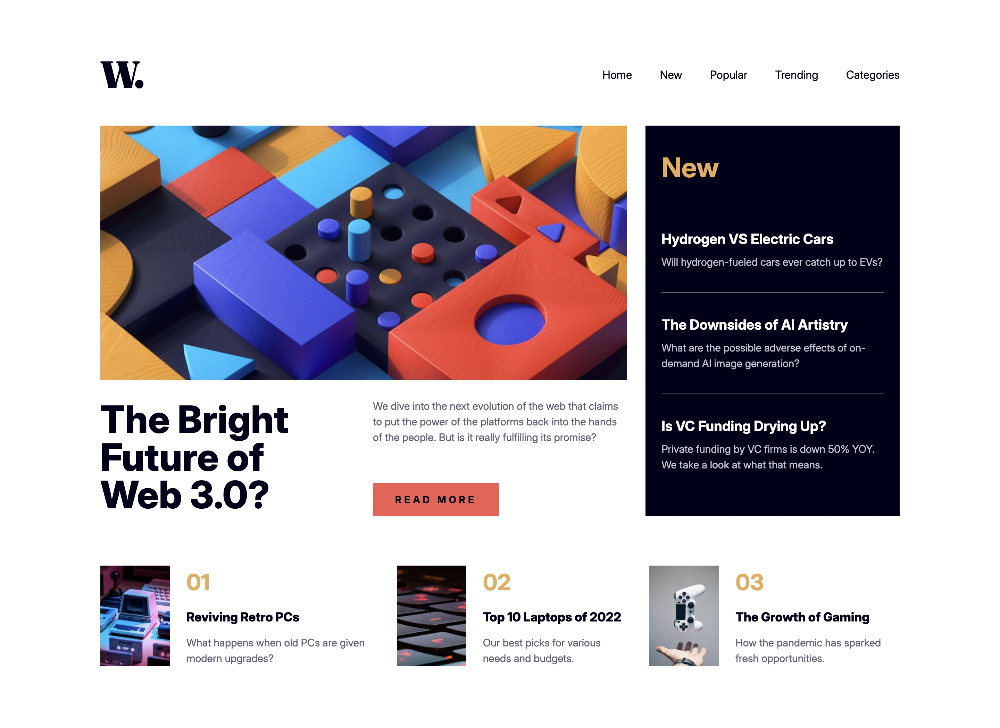
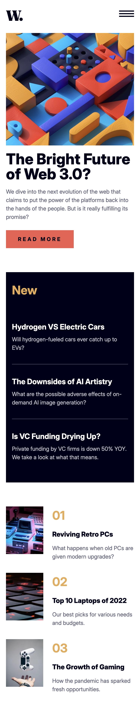
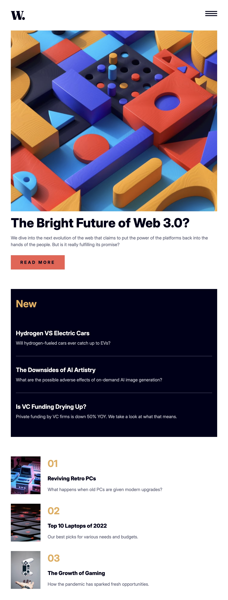

# Frontend Mentor - News homepage solution

This is a solution to the [News homepage challenge on Frontend Mentor](https://www.frontendmentor.io/challenges/news-homepage-H6SWTa1MFl). Frontend Mentor challenges help you improve your coding skills by building realistic projects.

## Table of contents

- [Frontend Mentor - News homepage solution](#frontend-mentor---news-homepage-solution)
  - [Table of contents](#table-of-contents)
  - [Overview](#overview)
    - [The challenge](#the-challenge)
    - [Screenshot](#screenshot)
    - [Links](#links)
  - [My process](#my-process)
    - [Built with](#built-with)
    - [What I learned](#what-i-learned)
    - [Useful resources](#useful-resources)

## Overview

### The challenge

Users should be able to:

- View the optimal layout for the interface depending on their device's screen size
- See hover and focus states for all interactive elements on the page
- Tab through all the main links to articles
- See the little animation for the menu hamburger button :)

### Screenshot

Desktop

Mobile

Tablet

### Links

- [Live Site URL](https://news-homepage.frilly.dev)

## My process

### Built with

- [Astro](https://astro.build)
- [Svelte](https://svelte.dev)
- [Tailwind CSS](https://tailwindcss.com)
- [Sass](https://sass-lang.com)

### What I learned

Animating with SVGs can be tricky, but as long as you have the correct elements, everything is as simple as normal CSS animations.

### Useful resources

- [VoiceOver Controls](https://dequeuniversity.com/screenreaders/voiceover-keyboard-shortcuts) - Needed to test on a desktop screen reader.
